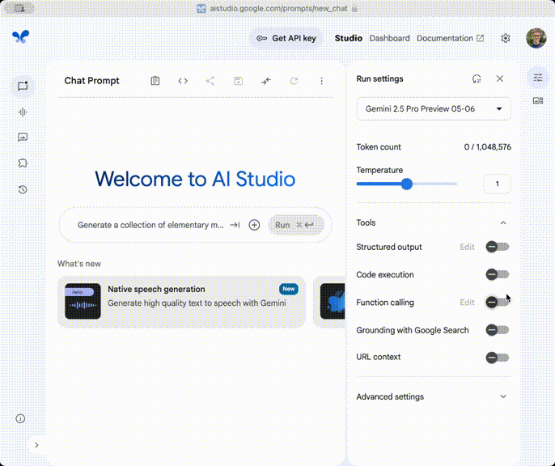

# MCP tools in Google AI Studio

A [userscript](https://en.wikipedia.org/wiki/Userscript) to use Model Context Protocol tools in Google AI Studio. This userscript allows you to

- import function declarations from an MCP server,
- automatically call tools and submit their result to the LLM.

## Demo

The video below illustrates the use of [DesktopCommanderMCP](https://github.com/wonderwhy-er/DesktopCommanderMCP), an MCP server to control your computer, in Google AI Studio. It illustrates how to import tools from an MCP server and how to explore this repository using a Gemini model. This is just an illustration, and you can use any MCP server that supports HTTP.



The current DesktopCommanderMCP does not yet support HTTP, and you will need start the server by running the following from the command line. The command starts a new MCP server listening on port 7777, and you can use http://localhost:7777 as the MCP server url in Google AI Studio.

```bash
npx github:tillahoffmann/DesktopCommanderMCP#http --port 7777
```

> [!WARNING]
> DesktopCommanderMCP is extremely powerful, but with great power comes great danger. It can execute (almost) any command on your machine and wreak havoc. See the recommendation of sandboxing DesktopCommanderMCP [below](#sandboxing-desktopcommandermcp).

## Usage

1. Enable the "Function calling" toggle in Google AI Studio.
2. Click on "Edit" to open the function declaration dialog.
3. Enter the URL of your MCP server and click "Load MCP Tools" which will populate the function declarations. Your MCP server can run locally or remotely.
4. Optionally, enable "Automatically submit tool results" which will automatically submit the result of tool calls to the LLM. If not enabled, you can review the results of the tool before submitting them.
5. Click the "Save" button.
6. Chat with Gemini and use tools.

## Installation

### Chrome (Tampermonkey)

1. Open the Tampermonkey dashboard (install from [here](https://www.tampermonkey.net/) if required).
2. Select the "Utilities" tab.
3. Scroll down to "Import from URL".
4. Enter https://raw.githubusercontent.com/tillahoffmann/ai-studio-mcp/refs/heads/main/ai-studio-mcp.user.js.
5. Hit the "Install" button.
6. Navigate to [Google AI Studio](https://aistudio.google.com/) or refresh the page.

### Userscripts (Safari)

1. Open the Userscripts dashboard (install from [here](https://github.com/quoid/userscripts) if required).
2. Select the Userscripts icon `</>` next to the search bar and click "Open Extension Page".
3. Click the ➕ icon in the top left and select "New Remote".
4. Enter https://raw.githubusercontent.com/tillahoffmann/ai-studio-mcp/refs/heads/main/ai-studio-mcp.user.js.
5. Save the newly created script.
6. Navigate to [Google AI Studio](https://aistudio.google.com/) or refresh the page.

## Sandboxing DesktopCommanderMCP

If you want to avoid accidents and ensure DesktopCommanderMCP (or any other MCP server) only has access to what it should, you can run the server inside a [Docker](https://www.docker.com) container using the following command.

```bash
docker run --rm \
-v `pwd`:/workdir -w /workdir \
-p 7777:7777 \
node npx github:tillahoffmann/DesktopCommanderMCP#http --port 7777
```

1. The first line indicates starting a container that is removed (`--rm`) after execution.
2. The second line mounts your current working directory (`pwd`) in the container at `/workdir` and sets the working directory of the container to `/workdir`. This ensures the container sees the same files as you do from the command line.
3. The third line exposes the port 7777 from the inside of the container to the outside.
4. The final line starts the DesktopCommanderMCP server and starts listening to requests on port 7777.
